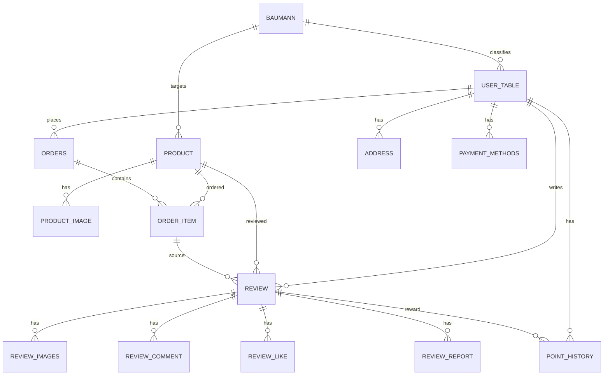

# Re_View

리뷰 기반 개인 맞춤 스킨케어 추천 커머스 서비스

Re_View는 사용자 리뷰와 Baumann 피부 타입 데이터를 기반으로 스킨케어 상품과 리뷰를 추천하는 풀스택 웹 서비스입니다. 단순 상품 조회 중심의 쇼핑몰이 아니라, 사용자 피부 타입, 상품 피부 타입, 리뷰 작성자의 피부 타입, 리뷰 반응 데이터를 함께 활용해 구매 판단에 도움이 되는 추천 결과를 제공합니다.

| 구분 | 링크 |
| --- | --- |
| Review 문서 | https://github.com/VenyVince/5.Re_View_Doc |
| Review 시연 영상 | https://www.youtube.com/watch?v=kP2HrcrGmvU |

## 목차

- [주요 기능](#주요-기능)
- [기술 스택](#기술-스택)
- [시스템 구조](#시스템-구조)
- [실행 방법](#실행-방법)
- [API 문서](#api-문서)
- [예외 응답 정책](#예외-응답-정책)
- [보안 정책](#보안-정책)
- [검증 결과](#검증-결과)
- [주요 API](#주요-api)
- [핵심 구현 내용](#핵심-구현-내용)
- [ERD](#erd)
- [DB 초기화 메모](#db-초기화-메모)
- [본인 기여도](#본인-기여도)
- [트러블슈팅](#트러블슈팅)
- [팀 구성 및 역할](#팀-구성-및-역할)
- [2주 안정화 작업 요약](#2주-안정화-작업-요약)
- [취업용 README 보강 항목](#취업용-readme-보강-항목)

## 주요 기능

### 사용자 기능

- 회원가입, 로그인, 로그아웃
- 상품 목록 및 상세 조회
- 리뷰 작성, 조회, 수정, 삭제
- 리뷰 좋아요, 싫어요, 댓글, 신고
- 장바구니, 위시리스트, 주문 처리
- 포인트 적립 및 사용
- 주소 및 결제수단 관리
- QnA 작성 및 조회
- Baumann 피부 타입 등록 및 수정
- 피부 타입 기반 상품 및 리뷰 추천

### 관리자 기능

- 상품 등록, 수정, 삭제
- 주문 상태 관리
- 사용자 관리 및 밴 처리
- 사용자 포인트 관리
- 리뷰 관리 및 관리자 추천 리뷰 선정
- 리뷰 신고 처리
- QnA 답변 관리

## 기술 스택

### Backend

- Java 21
- Spring Boot 3.5
- Spring Security
- MyBatis
- Oracle XE
- Spring Mail
- springdoc OpenAPI / Swagger
- MinIO SDK
- Lombok

### Frontend

- React
- React Router
- Axios
- Styled Components
- React Icons

### Infra

- Docker
- Docker Compose
- Nginx
- Oracle XE
- MinIO

## 시스템 구조

```text
Client
  |
  | HTTP Request
  v
React Frontend
  |
  | /api proxy
  v
Spring Boot Backend
  |
  | MyBatis
  v
Oracle Database

Spring Boot Backend
  |
  | Presigned URL
  v
MinIO Object Storage
```

### 백엔드 구조

```text
src/main/java/com/review/shop
├── config          # Security, CORS, 예외 처리 설정
├── controller      # REST API Controller
├── service         # 비즈니스 로직
├── repository      # MyBatis Mapper Interface
├── dto             # 요청 / 응답 DTO
├── image           # MinIO 이미지 처리
├── exception       # 커스텀 예외
└── util            # 인증 유틸, 스케줄러
```

## 실행 방법

Oracle 스키마와 MinIO bucket은 별도로 생성되어 있어야 합니다. DB 초기화 참고 사항은 [DB 초기화 메모](#db-초기화-메모)를 확인합니다.

### 1. 환경 변수 설정

`infra/.env` 파일을 생성하고 필요한 환경 변수를 설정합니다.

```properties
SPRING_DATASOURCE_URL=jdbc:oracle:thin:@//oracle-db:1521/XEPDB1
SPRING_DATASOURCE_USERNAME=app_user
SPRING_DATASOURCE_PASSWORD=password

MINIO_URL=http://minio:9000
MINIO_PUBLIC_URL=http://localhost:9000
MINIO_ROOT_USER=minioadmin
MINIO_ROOT_PASSWORD=minioadmin
MINIO_BUCKET=review

CORS_ALLOWED_ORIGINS=http://localhost:3000
REACT_APP_API_BASE_URL=http://localhost:8080
```

`MINIO_URL`은 백엔드가 MinIO에 접근하는 내부 주소이고, `MINIO_PUBLIC_URL`은 브라우저가 접근 가능한 공개 주소입니다. Presigned URL은 host까지 포함해 서명되므로 두 값을 혼동하면 이미지 업로드 또는 조회가 실패할 수 있습니다.

### 2. Docker Compose 실행

```bash
cd infra
docker-compose up -d
```

### 3. 백엔드 로컬 실행

```bash
mvnw.cmd spring-boot:run
```

### 4. 프론트엔드 로컬 실행

```bash
cd View
npm install
npm start
```

## API 문서

Springdoc OpenAPI를 통해 Swagger UI를 제공합니다.

```text
http://localhost:8080/swagger-ui/index.html
```

## 예외 응답 정책

전역 예외 응답은 `ErrorResponseDTO` 형식으로 통일합니다.

```json
{
  "status": 400,
  "code": "Validation Failed",
  "message": "id: 아이디는 필수입니다.",
  "path": "/api/auth/register",
  "timestamp": "2026-05-09T10:30:00"
}
```

| 상태 코드 | 의미 | 대표 상황 |
| --- | --- | --- |
| 400 | Bad Request | 잘못된 요청, DTO 검증 실패 |
| 401 | Unauthorized | 로그인 필요, 인증 실패 |
| 403 | Forbidden | 권한 부족 |
| 404 | Not Found | 대상 리소스 없음 |
| 500 | Internal Server Error | DB 오류, 파일 처리 오류, 기타 서버 오류 |

## 보안 정책

Spring Security 기반 세션 인증을 사용합니다. 로그인 성공 시 서버 세션에 인증 정보를 저장하고, 이후 요청은 세션 쿠키를 통해 인증됩니다.

### 공개 API

- Swagger 문서: `/v3/api-docs/**`, `/swagger-ui/**`, `/swagger-ui.html`
- 인증 진입점: `POST /api/auth/register`, `POST /api/auth/login`, `POST /api/auth/check-id`, `POST /api/auth/find-id`, `POST /api/auth/send-temp-password`
- 공개 탐색: `GET /api/products`, `GET /api/products/{product_id}`, `GET /api/reviews`, `GET /api/reviews/{review_id}`
- 상품 상세 보조 데이터: `GET /api/reviews/{product_id}/reviews`, `GET /api/products/{product_id}/reviews/search`, `GET /api/qna/list/{product_id}`
- 검색 및 메인 화면: `GET /api/search`, `GET /api/images/banners`, `GET /api/recommendations/admin-pick`

### 인증 필요 API

- 내 정보, 피부 타입, 비밀번호 변경: `/api/auth/me`, `/api/auth/my-baumann-type`, `/api/auth/reset-password`, `/api/users/me/**`
- 장바구니, 위시리스트, 주소, 결제수단, 포인트, 주문: `/api/cart/**`, `/api/wishlist/**`, `/api/addresses/**`, `/api/users/me/payments/**`, `/api/users/me/points/**`, `/api/orders/**`
- 리뷰 작성/수정/삭제, 댓글, 반응, 신고, 마이페이지 리뷰 검색
- QnA 작성/수정/삭제 및 내 문의 조회
- 개인화 추천: `/api/recommendations/all`

### 관리자 API

- `/api/admin/**`는 `ROLE_ADMIN` 권한이 필요합니다.

현재 `SecurityConfig`의 마지막 정책은 `anyRequest().permitAll()`입니다. `denyAll()`로 전환하기 전에는 공개 API, 인증 API, 관리자 API가 누락 없이 분류됐는지 테스트로 확인해야 합니다.

## 검증 결과

- 백엔드 테스트: 2026-05-12 14:18 KST 기준 `mvnw.cmd test` 통과.
- 프론트 빌드: 2026-05-12 14:18 KST 기준 `npm --prefix View run build` 성공.
- 예외 응답: `ExceptionHandlers`와 Spring Security 인증/인가 실패 응답은 `ErrorResponseDTO` 기반으로 정리되었습니다.
- Swagger: 인증 관련 API의 오류 응답 설명을 `ErrorResponseDTO` 기준으로 정리했습니다.
- 남은 경고: Mockito 동적 Java agent 로딩 경고, SpringDoc 운영 환경 비활성화 권장 경고, React Hook dependency와 미사용 변수/import 중심의 ESLint 경고가 남아 있습니다.
- 남은 검증: `anyRequest().denyAll()` 전환 전 공개 API, 인증 필요 API, 관리자 API 접근 테스트가 필요합니다.

## 주요 API

### 인증

| Method | URL | Description |
| --- | --- | --- |
| POST | `/api/auth/register` | 회원가입 |
| POST | `/api/auth/login` | 로그인 |
| POST | `/api/auth/logout` | 로그아웃 |
| GET | `/api/auth/me` | 현재 로그인 사용자 조회 |

### 상품 / 리뷰

| Method | URL | Description |
| --- | --- | --- |
| GET | `/api/products` | 상품 목록 조회 |
| GET | `/api/products/{product_id}` | 상품 상세 조회 |
| GET | `/api/reviews` | 리뷰 목록 조회 |
| GET | `/api/reviews/{review_id}` | 리뷰 상세 조회 |
| POST | `/api/reviews/{product_id}` | 리뷰 작성 |
| PATCH | `/api/reviews/{review_id}` | 리뷰 수정 |
| DELETE | `/api/reviews/{product_id}/{review_id}` | 리뷰 삭제 |

### 추천

| Method | URL | Description |
| --- | --- | --- |
| POST | `/api/recommendations/all` | 피부 타입 기반 상품 / 리뷰 추천 |
| GET | `/api/recommendations/admin-pick` | 관리자 추천 리뷰 조회 |

### 이미지

| Method | URL | Description |
| --- | --- | --- |
| POST | `/api/images/reviews` | 리뷰 이미지 업로드 URL 발급 |
| POST | `/api/images/products` | 상품 이미지 업로드 URL 발급 |
| POST | `/api/images/products/convert-data` | 상품 이미지 업로드 URL 발급 |
| POST | `/api/images/products/convert-datas` | 복수 상품 이미지 업로드 URL 발급 |
| GET | `/api/images/banners` | 배너 이미지 조회 |

### 주문

| Method | URL | Description |
| --- | --- | --- |
| POST | `/api/orders/checkout` | 주문 미리보기 |
| POST | `/api/orders` | 주문 처리 |
| GET | `/api/orders` | 주문 목록 조회 |
| GET | `/api/orders/{order_id}` | 주문 상세 조회 |

## 핵심 구현 내용

### Baumann 피부 타입 기반 추천

Baumann 피부 타입의 4가지 요소를 기준으로 사용자와 상품, 리뷰의 적합도를 계산합니다. 상품 추천은 상품 피부 타입 적합도와 리뷰 수 기반 점수를 합산한 `total_score`를 사용하고, 리뷰 추천은 리뷰 작성자의 피부 타입 일치도와 리뷰 반응 데이터를 반영한 `total_score`를 기준으로 정렬합니다.

### MinIO Presigned URL 기반 이미지 업로드

백엔드가 직접 파일을 저장하지 않고 MinIO Presigned URL을 발급합니다. 프론트엔드는 발급받은 URL로 MinIO에 직접 업로드하고, 백엔드는 object key를 DB에 저장합니다.

### 주문 / 포인트 / 재고 트랜잭션 처리

주문 처리 과정에서 사용자 포인트 차감, 상품 재고 차감, 주문 정보 저장, 주문 상세 정보 저장을 하나의 트랜잭션으로 처리합니다. 클라이언트가 전달한 가격을 그대로 신뢰하지 않고 서버에서 상품 가격을 다시 조회해 최종 금액을 계산합니다.

### 리뷰 보상 시스템

사용자가 구매 상품에 리뷰를 작성하면 리뷰 작성 보상으로 100포인트가 지급됩니다. 리뷰를 삭제하면 지급된 리뷰 작성 보상 100포인트가 회수됩니다.

베스트 리뷰는 매월 1일 00:00(Asia/Seoul)에 자동 갱신됩니다. 상품별 리뷰 수와 좋아요, 싫어요, 댓글 기준으로 선정된 리뷰에 700포인트가 지급되며, 동일 리뷰에 같은 베스트 리뷰 보상이 중복 지급되지 않도록 포인트 이력을 기준으로 확인합니다.

관리자가 리뷰를 선정하면 운영자 리뷰 채택 보상으로 500포인트가 지급됩니다.

### 관리자 기능 분리

관리자 API를 `/api/admin/**` 경로로 분리하여 상품, 주문, 사용자, 리뷰, 신고, QnA를 관리할 수 있도록 구현했습니다.

## ERD

핵심 관계는 회원, 상품, 주문, 리뷰, 포인트, 이미지 흐름을 중심으로 구성됩니다. 상세 ERD 메모는 [logs/ERD.md](logs/Other/ERD.md)에 정리했습니다.



## DB 초기화 메모

현재 저장소에는 바로 실행 가능한 최신 DDL/seed SQL을 포함하지 않습니다. 외부 문서 저장소의 Oracle DDL은 `"USER"`, `"ORDER"` 같은 레거시 테이블명을 포함하므로 현재 mapper 기준인 `USER_TABLE`, `ORDERS`와 대조해 보정해야 합니다.

초기화 권장 순서:

1. Oracle XE 사용자와 권한 준비
2. `BAUMANN`, `USER_TABLE`, `PRODUCT` 등 기준 테이블 생성
3. 상품 이미지, 주소, 결제수단, 주문, 리뷰, 포인트, QnA 순서로 의존 테이블 생성
4. `BAUMANN` 기준 데이터와 상품 샘플 데이터 적재
5. `GET /api/products`, `GET /api/reviews`, `POST /api/auth/login`으로 DB 연결 검증

상세 메모는 [logs/DB_INIT.md](logs/Other/DB_INIT.md)에 정리했습니다.

## 본인 기여도

| 영역 | 기여 내용 |
| --- | --- |
| 백엔드/인프라 안정화 | 로컬/Docker 실행 환경을 점검하고 DB, MinIO, CORS, 환경 변수 문제를 코드 문제와 분리해 정리했습니다. |
| 보안 정책 정리 | 세션 인증 방식을 유지하면서 공개 API, 인증 필요 API, 관리자 API를 분류하고 `SecurityConfig` matcher에 반영했습니다. |
| 예외 응답 표준화 | 인증 실패 401, 권한 부족 403을 분리하고 `ErrorResponseDTO` 기반 공통 JSON 응답으로 정리했습니다. |
| 이미지 처리 | MinIO presigned URL 기반 업로드/조회 흐름을 유지하면서 object key와 조회용 URL의 책임을 분리했습니다. |
| 추천/리뷰 보상 검증 | Baumann 기반 추천 점수와 리뷰 작성/삭제/베스트/관리자 선정 보상 흐름을 코드 기준으로 확인했습니다. |
| 문서화 | 실행 방법, 보안 정책, 예외 응답, ERD, DB 초기화, 트러블슈팅, 2주 안정화 결과를 README와 logs 문서로 정리했습니다. |

## 트러블슈팅

| 문제 | 원인 | 해결 |
| --- | --- | --- |
| Docker 백엔드에서 Oracle 접속 실패 | 컨테이너 내부 `localhost`가 Oracle 컨테이너가 아니라 백엔드 컨테이너 자신을 가리킴 | Docker Compose 환경에서는 `SPRING_DATASOURCE_URL=jdbc:oracle:thin:@//oracle-db:1521/XEPDB1`처럼 서비스명을 사용하도록 정리 |
| MinIO presigned URL이 브라우저에서 열리지 않음 | 백엔드는 `minio:9000`으로 접근하지만 브라우저는 Docker 내부 DNS 이름을 해석하지 못함 | 내부 접속용 `MINIO_URL`과 공개 접근용 `MINIO_PUBLIC_URL`을 분리해야 한다는 기준을 문서화 |
| 보호 API 인증 실패와 권한 부족이 구분되지 않음 | Spring Security entry point와 access denied handler 응답 기준이 명확하지 않음 | 미로그인 접근은 401, 권한 부족은 403과 `ErrorResponseDTO`로 반환하도록 정리 |
| 리뷰 수정 시 기존 이미지가 사라질 수 있음 | 기존 이미지는 presigned URL, 새 이미지는 object key로 전달되는데 모두 새 저장 값처럼 처리됨 | `http`로 시작하는 조회용 URL은 저장 대상에서 제외하고 새 object key가 있을 때만 이미지 매핑을 교체 |
| 헤더 검색 리뷰가 이미지 수만큼 중복될 수 있음 | `review_images` 다중 조인으로 리뷰 row가 이미지 개수만큼 늘어남 | 검색 카드에는 대표 이미지 1장만 필요하므로 단일 이미지 조회로 응답 구조를 단순화 |
| MinIO 업그레이드 후 인증 정보 바인딩 불일치 | access key/secret key 기준 설정과 root user/root password 환경 변수가 섞임 | `minio.root-user`, `minio.root-password` 기준으로 Spring properties, 설정 클래스, Docker 환경 변수를 통일 |

## 팀 구성 및 역할

| 이름 | 역할 | 담당 영역 |
| --- | --- | --- |
| 김석현 | 팀장 / 백엔드 / 인프라 | DB 설계, 회원, 포인트, 결제수단, 장바구니, 이미지 처리, 추천 알고리즘, MinIO, 배포 |
| 이재빈 | 백엔드 | 로그인, 결제, 구매, 추천 알고리즘 |
| 정윤성 | 백엔드 | 상품, 리뷰, QnA, 커뮤니티 |
| 오승환 | 프론트엔드 | 마이페이지 전체 UI |
| 김시연 | 프론트엔드 | 관리자 페이지, 설문조사 UI |
| 박진성 | 프론트엔드 | 검색, 상품, 리뷰 페이지 UI |

## 2주 안정화 작업 요약

| Day | 핵심 내용 |
| --- | --- |
| Day 1 | 로컬 백엔드/프론트 실행, Docker Compose 기동, DB/MinIO/CORS 환경 이슈 분리 |
| Day 2 | Dockerfile의 `.env` 복사 제거, `infra/.env.example` 추가, 런타임 환경 변수 주입 구조 정리 |
| Day 3 | 전체 API를 공개, 인증 필요, 관리자 API로 분류하고 `SecurityConfig` matcher 초안 작성 |
| Day 4 | `SecurityConfig`에 인증/인가 정책 적용, 세션 인증과 충돌하던 Bearer token 전송 제거 |
| Day 5 | 인증 실패 401, 권한 부족 403 분리 및 `ErrorResponseDTO` 기반 예외 응답 표준화 |
| Day 6 | Swagger 오류 응답 설명, 테스트 프로파일, README 초안, 깨진 한글 주석 정리 |
| Day 7 | `mvn test` 재확인 및 보안/예외/주문/리뷰 테스트 후보 정리 |
| Day 8 | 베스트 리뷰 스케줄러 활성화, 리뷰 작성/삭제/베스트/관리자 선정 보상 흐름 확인 |
| Day 9 | 프론트 빌드 경고 확인, 남은 Hook dependency와 미사용 변수 cleanup 기준 정리 |
| Day 10 | 최종 `mvn test`, 프론트 빌드 검증, README와 최종 작업 요약 반영 |

## 취업용 README 보강 항목

- 서비스 문제 정의: 왜 리뷰와 피부 타입 기반 추천이 필요한지 한 문단으로 정리
- 본인 기여도: 담당 기능, 설계 결정, 트러블슈팅을 별도 섹션으로 분리
- ERD: 사용자, 상품, 리뷰, 주문, 포인트, 이미지 중심의 핵심 테이블 관계 추가
- API 인증 정책 표: 공개 / 인증 필요 / 관리자 API를 표로 정리
- 예외 응답 정책: `ErrorResponseDTO` 도입 전후 차이와 프론트 처리 장점 설명
- 테스트 결과: `mvn test`, 프론트 빌드, Docker Compose 실행 확인 결과를 날짜와 함께 기록
- 트러블슈팅: CORS, MinIO Presigned URL, Security 401/403 분리, 테스트 프로파일 문제를 사례로 정리
- 아키텍처 다이어그램: React, Nginx, Spring Boot, Oracle, MinIO 흐름을 이미지로 추가

## 개선 예정 사항

- `anyRequest().denyAll()` 전환을 위한 endpoint 테스트 보강
- 실행 가능한 최신 DDL 및 샘플 데이터 SQL 분리
- MinIO bucket 존재 확인 정책 추가
- 주문, 포인트, 추천 서비스 테스트 추가
- GitHub Actions CI 추가
