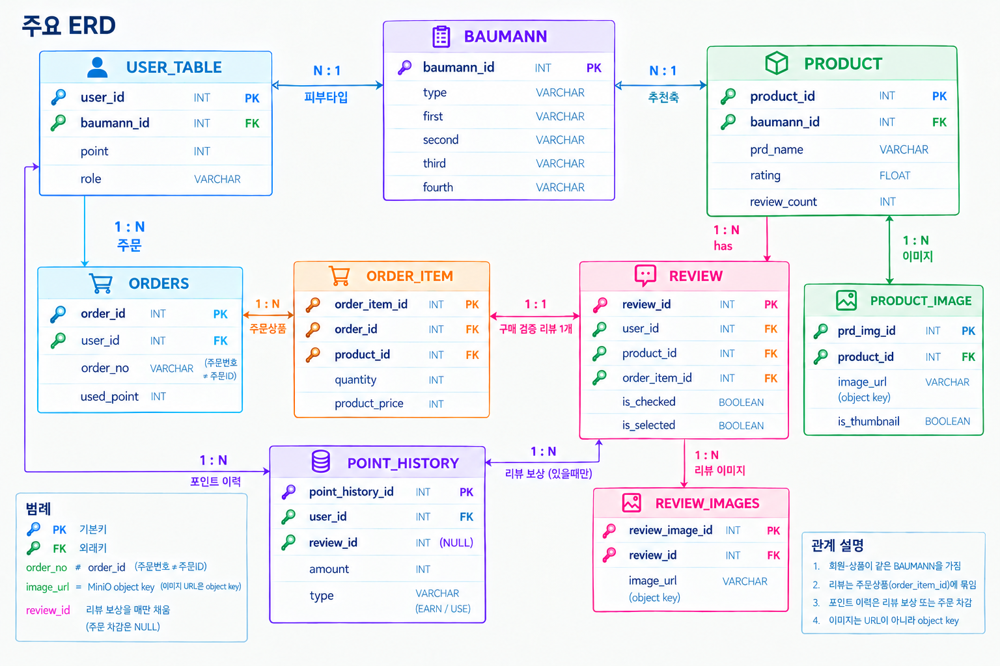
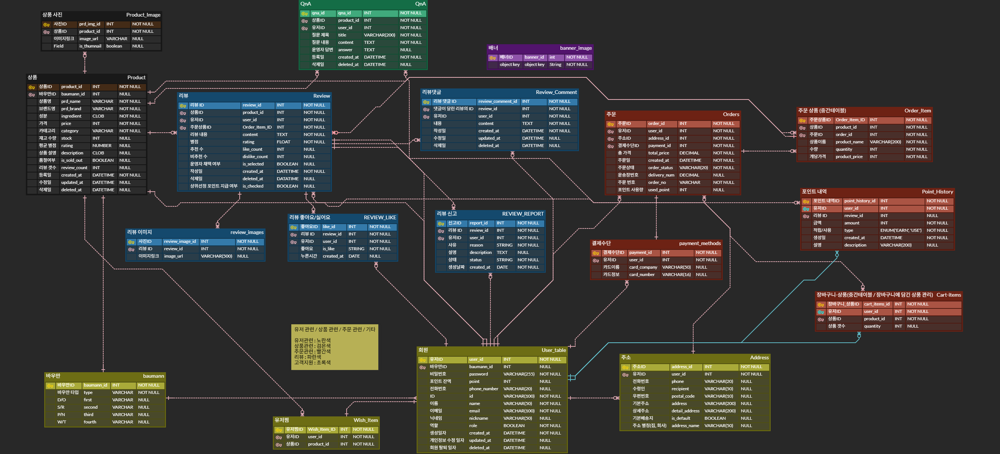
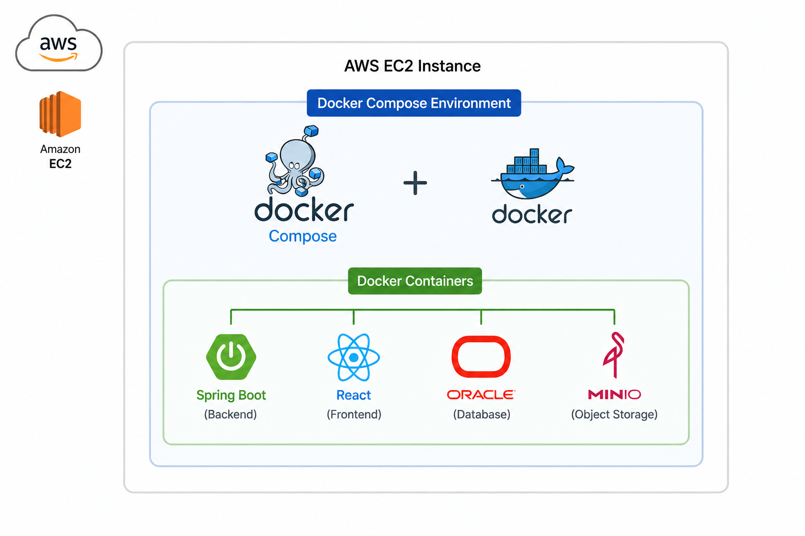
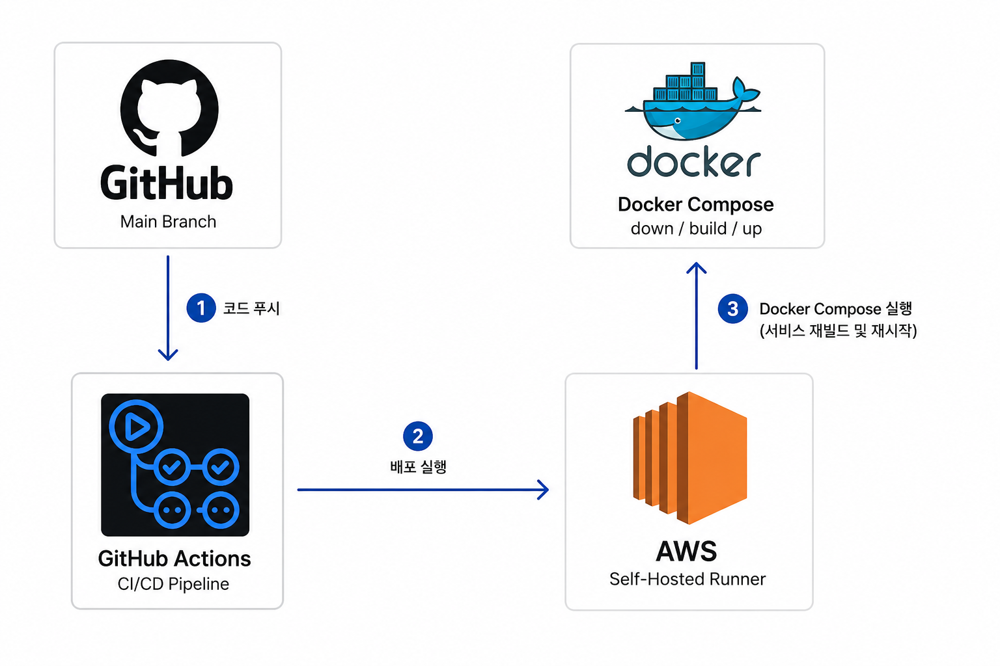
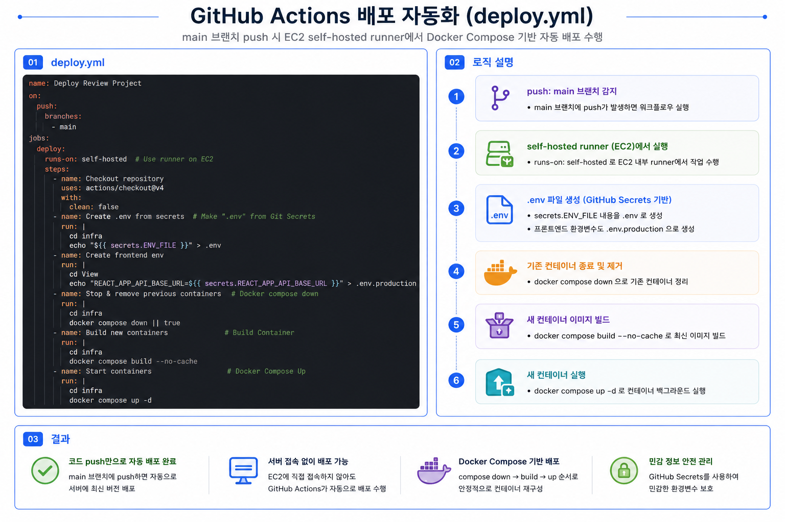

# Re:View

바우만 피부타입 기준으로하는 화장품 리뷰·상품 커머스입니다.
MBTI와 같이 피부 타입을 건성/지성·민감·색소·탄력/주름 네 축의 조합을 가지고 16가지로 나눈 분류입니다.
이 프로젝트의 목적은 리뷰가 아무리 많아도 “사용자에게 알맞은 상품”을 찾기 어렵다는 문제를, 4축 가중치 추천과 베스트 리뷰 선정으로 보완/해결하는 것입니다.

바우만 피부 타입을 통해 명확한 기준이 없는 피부 타입을 최소한으로 규정할 수 있다는 점에서 해당 기준을 채택하였습니다.

프론트 화면 대부분은 팀원들이 작업하였으며, README는 백엔드·인프라 담당 범위 Veny(김석현)의 기준입니다.

[시연 영상](https://www.youtube.com/watch?v=kP2HrcrGmvU) · [포트폴리오](https://app.notion.com/p/3e4e8ff09ebd803397fcf7744f36391e) · [문서](https://github.com/VenyVince/Re_View_Doc)

---

## 1. 프로젝트 개요

### 주제

회원·상품·리뷰에 바우만 16타입을 붙인 뒤, 겹치는 축이 많은 상품·후기를 앞에 두는 스킨케어 리뷰 커머스입니다. 쇼핑몰 CRUD 위에 가중치 추천, object storage 이미지, 리뷰 보상 포인트 등을 다루고 있습니다.

### 일정 · 인원 · 역할

| | |
| --- | --- |
| 팀 개발 | 2025.10 – 2025.12 |
| 개인 보강 | 2026.05 (인가 matcher, 예외/Validation, 스케줄러 활성화) |
| 인원 | 6명 |
| 역할 | 팀장 / 백엔드 / 인프라 |

### 스택

| 구분 | 기술 |
| --- | --- |
| Backend | Java 21, Spring Boot 3, Spring Security(세션 + CSRF), MyBatis, Validation, Swagger |
| Frontend | React, axios (`withCredentials`) |
| Data | Oracle XE, MinIO (Presigned URL) |
| Infra | Docker Compose, Nginx, GitHub Actions (self-hosted runner on EC2) |

### 본인(Veny / 석현) 담당 범위

#### 백엔드

| 도메인 | 내용 |
| --- | --- |
| 검색 | 헤더·관리자 검색. 키워드 2글자 이상, 상품+리뷰, 정렬, 브랜드/카테고리 필터 |
| 회원 | 회원정보 조회·수정·탈퇴, 바우만 타입 변경 |
| 쇼핑 | 장바구니 CRUD, 찜, 결제수단 |
| 포인트 | 리뷰 보상 적립/회수, `SELECT … FOR UPDATE` 잔액 갱신 |
| 추천 | 바우만 4축 가중치 SQL, 상품당 리뷰 1개, 베스트 가중치 |
| 리뷰 배치 | 월간 베스트 리뷰 선정(상품별 상위 10%) 및 포인트 지급 |
| 이미지 | MinIO Presigned URL 발급, DB에는 object key, 조회 시 단기 GET URL |
| 보안 | 공개/인증/관리자 matcher, 401/403 JSON, CSRF, DTO Validation, 전역 예외 |

#### 인프라

| 도메인 | 내용 |
| --- | --- |
| 실행 환경 | Docker Compose로 Oracle XE, MinIO, BE, FE(nginx) 일괄 기동 |
| 배포 | GitHub Actions self-hosted runner, EC2에서 Secrets 주입 후 `compose up` |
| 프록시 | nginx 정적 서빙, `/api` → BE |


### 주요 구현 내용

- **가중치식 추천** — 바우만 4축이 얼마나 겹치는지를 보고, 리뷰 수·별점 유사도·베스트 가중치까지 더해 상품당 후기 하나를 골라 줍니다.
- **Presigned URL 이미지 파이프라인** — 파일은 백엔드가 받지 않고, Presigned URL만 발급한 뒤 DB에는 object key만 남깁니다.
- **포인트 row lock** — 잔액을 조회하고 계산한 뒤 갱신하는 동안 `SELECT … FOR UPDATE`로 한 트랜잭션에 묶어 두었습니다.
- **Compose 기반 EC2 배포** — Oracle / MinIO / BE / FE를 한 번에 올리고, GitHub Actions로 배포합니다.

추천 SQL을 직접 다루고 싶어서 MyBatis를 썼고, 비용과 로컬 재현을 생각해 S3 대신 MinIO를 골랐습니다. 세션 기반 SPA를 유지하려고 JWT로 바꾸지 않고 CSRF만 맞춰 두었습니다.

---

## 2. 프로젝트 구조

### 주요 ERD

핵심 관계만 표시. 이미지 URL 컬럼은 object key.



회원·상품이 같은 `BAUMANN`을 공유하고, 추천 SQL이 4축을 점수로 변환. 베스트 리뷰는 `REVIEW.is_checked`, 운영자 픽은 `is_selected`. 포인트 잔액은 `USER_TABLE.point`, 이력은 `POINT_HISTORY`. 리뷰는 주문상품(`order_item_id`)에 묶인다.

<details>
<summary>전체 ERD</summary>



</details>

### 서버 · 배포 구조



```
Browser
  ├─ :3000  React (nginx가 /api → BE)
  └─ :9000  MinIO  ← FE가 Presigned URL로 PUT/GET
         │
EC2 (Docker Compose)
  ├─ fe      nginx :80 → host 3000
  ├─ be      Spring :8080
  ├─ oracle  XE :1521
  └─ minio   :9000 / console :9001
```

이미지 경로:

```
FE 파일명 요청
  → BE: PUT Presigned URL + object key
  → FE: MinIO에 바이너리 업로드
  → 리뷰/상품 API: key만 DB 저장
  → 조회 API: key → 단기 GET URL
```

배포경로 (main 브랜치 push 시):





```
GitHub Actions (self-hosted on EC2)
  → Secrets로 infra/.env, View/.env.production 생성
  → docker compose down
  → docker compose build --no-cache && up -d
```

Docker 이미지 빌드에 `.env`를 넣지 않음. 실행 시 `env_file`·Secrets로 주입. 로컬 실행:

```bash
cp infra/.env.example infra/.env
cd infra && docker compose up -d --build
```

| | |
| --- | --- |
| FE | http://localhost:3000 |
| Swagger | http://localhost:8080/swagger-ui.html |
| MinIO | http://localhost:9001 |

Oracle XE 첫 기동은 시간이 김.

---

## 3. 프로젝트 주요 기능

### 3-1. 담당 구현

#### 가중치식 추천

로그인 사용자의 `BAUMANN` 4축(건성/지성, 민감, 색소, 탄력/주름)으로 상품·리뷰 랭킹.

- 상품: 축 일치 30 / null 10 / 불일치 0 + 리뷰 수 가점, **40점 이상**, 상위 16개
- 리뷰: 작성자 타입 + 상품 타입 + 별점 유사도. 베스트(`is_checked`) ×1.2
- `ROW_NUMBER() PARTITION BY product_id`로 상품당 후기 1개
- 리뷰 이미지 없으면 상품 썸네일 대체 후 Presigned GET

완전 일치만 필터하면 추천이 비기 쉬워, 가중치로 줄 세움.

#### Presigned URL 이미지 파이프라인

로컬 디스크 업로드에서 object storage로 이전. BE는 multipart를 받지 않음.

리뷰 수정 시 FE가 화면의 GET Presigned URL을 그대로 보내, 만료 URL이 object key처럼 저장되던 문제. `http`로 시작하면 무시, 신규 key가 있을 때만 교체. key가 없으면 기존 매핑 유지.

내부 Docker 호스트(`minio:9000`) 서명은 브라우저가 열지 못함. 공개/내부 클라이언트 분리는 후처리(스캔·리사이즈)가 없어 보류. 현재 클라이언트 1개.

#### 검색

헤더·관리자 검색을 같은 서비스로 제공. 키워드 2글자 이상, 상품+리뷰, 정렬(최신/별점/인기 등), 브랜드·카테고리 필터. 결과 이미지는 object key → Presigned URL. 관리자 주문 검색은 상태/정렬을 서비스에서 추가 필터.

#### 포인트 · 월간 베스트 리뷰

리뷰 작성 100 / 운영자 채택 500 / 베스트 700. 잔액 갱신은 `USER_TABLE`을 `SELECT … FOR UPDATE`한 뒤 트랜잭션 안에서 계산. 운영 중 잔액 오류 실측이 아니라, 조회-계산-갱신 레이스 가능성에 대한 예방.

베스트 선정 SQL: 좋아요 20 초과 · 상품 리뷰 30 초과, 상품별 좋아요→싫어요→댓글 상위 **10%**. 매월 1일 0시(`Asia/Seoul`). 스케줄러 클래스는 팀 기간에 존재, **`@EnableScheduling` 누락으로 미실행 → 2026.05에 활성화.**

남은 이슈: 베스트 포인트 중복 체크가 lock보다 앞. 다음 작업은 락 이후 체크.

#### 회원 · 쇼핑 API

회원정보 조회/수정/탈퇴, 바우만 타입 변경, 장바구니 CRUD, 찜, 결제수단, 포인트 내역. 목록 썸네일은 Presigned GET.

#### 배포 · 인가

Compose로 Oracle·MinIO·BE·FE 일괄 기동. Actions self-hosted runner가 Secrets로 env 생성 후 `compose up`.

2026.05에 공개/인증/관리자 matcher 분류, 401/403 JSON, CSRF 쿠키 + axios 헤더, DTO Validation, 전역 예외. **마지막은 `anyRequest().permitAll()`이라 목록 밖 API는 열린 상태.** 보안 테스트는 `testcode` 브랜치에만 존재.

---

### 3-2. 팀 구현 (요약)

| 영역 | 내용 |
| --- | --- |
| 인증·회원 | 회원가입/로그인(세션), 아이디·임시 비밀번호, 바우만 설문 |
| 상품 | 목록/상세, 관리자 상품 등록·수정 |
| 리뷰 | 작성·수정·삭제, 댓글, 좋아요/싫어요, 상세 페이지 |
| 주문 | 재고 차감, 주문 생성, 배송 상태, 관리자 주문 |
| QnA · 신고 | 상품 QnA, 리뷰 신고, 관리자 처리 |
| 프론트 | 메인/검색/리뷰 피드, 결제 화면, 관리자 UI 대부분 |

주문 재고는 조회 후 차감이 아니라 차감 row 수로 실패 판단. 포인트 갱신은 담당 `PointService`를 주문 쪽에서 호출.

---

## 4. 코드맵 (담당 파일)

리뷰 시 확인할 백엔드·인프라 파일. 프론트 화면 파일은 제외.

| 항목 | 경로 |
| --- | --- |
| 가중치 추천 SQL | `src/main/resources/mapper/recommendations/RecommendationsMapper.xml` |
| 추천 서비스 | `src/main/java/com/review/shop/service/recommendations/RecommendationsService.java` |
| Presigned 발급/조회 | `src/main/java/com/review/shop/image/ImageService.java` |
| MinIO 클라이언트 | `src/main/java/com/review/shop/image/minio/MinioConfig.java` |
| 리뷰 수정 시 URL≠key | `ProductReviewService.filterObjectKeys` |
| 헤더/관리자 검색 | `.../service/search/HeaderSearchService.java` |
| 검색 SQL | `mapper/search/header/HeaderSearchReviewMapper.xml` |
| 포인트 + row lock | `.../service/userinfo/other/PointService.java` |
| `FOR UPDATE` | `mapper/userinfo/other/point/PointMapper.xml` |
| 베스트 선정 SQL | `mapper/review/ProductreviewMapper.xml` (`selectBestReviewIds`) |
| 월간 스케줄러 | `.../util/ReviewScheduler.java` (`@EnableScheduling`은 `ReViewApplication`) |
| 장바구니/찜/결제수단 | `controller/userinfo/*`, `service/userinfo/other/*` |
| 인가 · 401/403 | `.../config/SecurityConfig.java` |
| 전역 예외 | `.../config/ExceptionHandlers.java` |
| Compose | `infra/docker-compose.yml` |
| CI/CD | `.github/workflows/deploy.yml` |

---

## 한계

- `anyRequest().permitAll()`, `/minio/test` 잔존
- 베스트 포인트 중복 체크가 lock보다 앞
- Presigned URL 구분이 `startsWith("http")`
- main 테스트는 `contextLoads()` 수준

다음 작업: deny-by-default, 중복 체크를 lock 뒤로, 이미지 요청 DTO 분리, 보안 테스트 main 병합, 단위 테스트.
