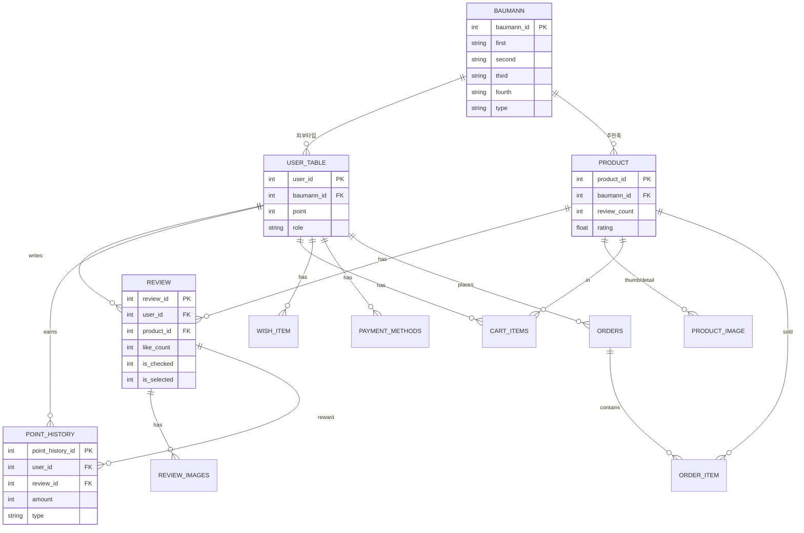

# Re:View

바우만 피부타입 기준으로 화장품 리뷰와 상품을 연결하는 팀 커머스입니다.  
리뷰가 많아도 “나와 비슷한 피부의 후기”를 찾기 어려워서, 4축 점수 추천과 베스트 리뷰 선정으로 그 간극을 줄이려 했습니다.

프론트 화면의 대부분은 다른 팀원 작업입니다. 이 README는 **백엔드·인프라를 맡은 제 기여**를 기준으로 썼습니다.

[시연 영상](https://www.youtube.com/watch?v=kP2HrcrGmvU) · [포트폴리오](https://app.notion.com/p/3e4e8ff09ebd803397fcf7744f36391e) · [문서](https://github.com/VenyVince/Re_View_Doc)

---

## 1. 프로젝트 개요

### 주제

피부타입(바우만 16타입)을 회원·상품·리뷰에 붙인 뒤, **같은 축이 많이 겹치는 상품·후기**를 먼저 보여 주는 스킨케어 리뷰 커머스입니다. 일반적인 쇼핑몰 CRUD에 추천 랭킹, 이미지 object storage, 리뷰 보상 포인트를 얹었습니다.

### 일정 · 인원 · 역할

| | |
| --- | --- |
| 팀 개발 | 2025.10 – 2025.12 |
| 개인 보강 | 2026.05 (인가 matcher, 예외/Validation, 스케줄러 활성화) |
| 인원 | 6명 |
| 내 역할 | 팀장 / 백엔드 / 인프라 |

**내가 맡은 범위:** 검색, 마이페이지(회원정보·장바구니·찜·결제수단·포인트), MinIO 이미지, 바우만 추천 SQL, 월간 베스트 리뷰 스케줄러, Docker Compose, GitHub Actions EC2 배포, Spring Security 정리

### 스택

| 구분 | 기술 |
| --- | --- |
| Backend | Java 21, Spring Boot 3, Spring Security(세션 + CSRF), MyBatis, Validation, Swagger |
| Frontend | React, axios (`withCredentials`) |
| Data | Oracle XE, MinIO (Presigned URL) |
| Infra | Docker Compose, Nginx, GitHub Actions (self-hosted runner on EC2) |

### 기능적 포인트 (채용 관점에서 볼 곳)

1. **추천이 필터가 아니라 점수식** — 바우만 4축 일치 + 리뷰 수/별점 유사도 + 베스트 가중치, 상품당 리뷰 1개
2. **이미지는 서버가 파일을 받지 않음** — Presigned URL 발급, DB에는 object key만 저장
3. **포인트는 조회-계산-갱신을 row lock으로 묶음** — `SELECT … FOR UPDATE`
4. **배포가 로컬에서 끊기지 않음** — Oracle / MinIO / BE / FE를 Compose로 묶고 Actions로 EC2에 올림

기술 선택 근거는 이력서와 같습니다. 복잡한 추천 SQL을 직접 쓰기 위해 MyBatis, 비용·로컬 재현을 위해 S3 대신 MinIO, 이미 SPA가 세션 쿠키를 쓰므로 JWT로 갈아엎지 않고 CSRF를 맞췄습니다.

---

## 2. 프로젝트 구조

### 주요 ERD

핵심만 그렸습니다. 이미지 URL 컬럼은 **object key**를 담습니다.


```mermaid
erDiagram
    BAUMANN ||--o{ USER_TABLE : "피부타입"
    BAUMANN ||--o{ PRODUCT : "추천축"
    USER_TABLE ||--o{ REVIEW : writes
    USER_TABLE ||--o{ POINT_HISTORY : earns
    USER_TABLE ||--o{ CART_ITEMS : has
    USER_TABLE ||--o{ WISH_ITEM : has
    USER_TABLE ||--o{ PAYMENT_METHODS : has
    USER_TABLE ||--o{ ORDERS : places
    PRODUCT ||--o{ REVIEW : has
    PRODUCT ||--o{ PRODUCT_IMAGE : "thumb/detail"
    PRODUCT ||--o{ CART_ITEMS : in
    REVIEW ||--o{ REVIEW_IMAGES : has
    REVIEW ||--o{ POINT_HISTORY : reward
    ORDERS ||--o{ ORDER_ITEM : contains
    PRODUCT ||--o{ ORDER_ITEM : sold

    BAUMANN {
        int baumann_id PK
        string first
        string second
        string third
        string fourth
        string type
    }
    USER_TABLE {
        int user_id PK
        int baumann_id FK
        int point
        string role
    }
    PRODUCT {
        int product_id PK
        int baumann_id FK
        int review_count
        float rating
    }
    REVIEW {
        int review_id PK
        int user_id FK
        int product_id FK
        int like_count
        int is_checked
        int is_selected
    }
    POINT_HISTORY {
        int point_history_id PK
        int user_id FK
        int review_id FK
        int amount
        string type
    }
```

회원·상품이 같은 `BAUMANN`을 공유하고, 추천 SQL이 이 4축을 점수로 바꿉니다. 베스트 리뷰는 `REVIEW.is_checked`, 운영자 픽은 `is_selected`입니다. 포인트 잔액은 `USER_TABLE.point`, 이력은 `POINT_HISTORY`입니다.

### 서버 · 배포 구조

```
Browser
  ├─ :3000  React (nginx가 /api → BE)
  └─ :9000  MinIO  ← FE가 Presigned URL로 PUT/GET
         │
EC2 (Docker Compose)
  ├─ fe      nginx :80 → host 3000
  ├─ be      Spring :8080
  ├─ oracle  XE :1521
  └─ minio   :9000 / console :9001
```

이미지 경로:

```
FE 파일명 요청
  → BE: PUT Presigned URL + object key
  → FE: MinIO에 바이너리 업로드
  → 리뷰/상품 API: key만 DB 저장
  → 조회 API: key → 단기 GET URL
```

배포 경로 (`main` push):

```
GitHub Actions (self-hosted on EC2)
  → Secrets로 infra/.env, View/.env.production 생성
  → docker compose down
  → docker compose build --no-cache && up -d
```

이미지에 `.env`를 굽지 않습니다. 로컬 실행:

```bash
cp infra/.env.example infra/.env
cd infra && docker compose up -d --build
```

| | |
| --- | --- |
| FE | http://localhost:3000 |
| Swagger | http://localhost:8080/swagger-ui.html |
| MinIO | http://localhost:9001 |

Oracle XE는 첫 기동이 깁니다.

---

## 3. 프로젝트 주요 기능

### 3-1. 내가 구현한 것

#### 바우만 추천 스코어링

로그인 사용자의 `BAUMANN` 4축(건성/지성, 민감, 색소, 탄력/주름)을 읽고 상품·리뷰를 점수순으로 자릅니다.

- 상품: 축 일치 30 / null 10 / 불일치 0 + 리뷰 수 가점, **40점 이상**, 상위 16개
- 리뷰: 작성자 타입 + 상품 타입 + 별점 유사도. 베스트(`is_checked`)는 ×1.2
- `ROW_NUMBER() PARTITION BY product_id`로 **상품당 후기 1개**
- 리뷰 이미지가 없으면 상품 썸네일로 대체한 뒤 Presigned GET으로 변환

“같은 타입만 WHERE”가 아니라 점수로 줄 세운 이유는, 완전 일치 행이 비면 추천이 공백이 되기 때문입니다.

#### 이미지 파이프라인 (MinIO Presigned URL)

로컬 디스크 업로드에서 object storage로 옮겼습니다. BE는 multipart를 받지 않습니다.

트러블슈팅: 리뷰 수정 시 FE가 화면에 쓰던 **GET Presigned URL**을 그대로 내려보내, 만료 URL이 object key처럼 DB에 저장됐습니다. `http`로 시작하면 무시하고, 신규 key가 있을 때만 이미지를 갈아끼웁니다. key가 없으면 기존 매핑을 유지합니다.

내부 Docker 호스트(`minio:9000`)로 서명하면 브라우저가 이미지를 못 여는 문제는 인지했습니다. 공개/내부 클라이언트 분리는 후처리(스캔·리사이즈)가 없어 이점이 작다고 보고 **보류**했고, 현재 코드는 클라이언트 1개입니다.

#### 검색

헤더·관리자 검색을 같은 서비스로 제공합니다. 키워드 2글자 이상, 상품+리뷰, 정렬(최신/별점/인기 등), 브랜드·카테고리 필터. 결과 이미지도 object key → Presigned URL입니다. 관리자 주문 검색은 상태/정렬을 서비스에서 한 번 더 거릅니다.

#### 포인트 · 월간 베스트 리뷰

리뷰 작성 100 / 운영자 채택 500 / 베스트 700. 잔액 갱신은 `USER_TABLE`을 `SELECT … FOR UPDATE`한 뒤 트랜잭션 안에서 계산합니다. “잔액이 어긋나는 현상을 운영에서 잡았다”가 아니라, 조회-계산-갱신 레이스가 날 수 있어 막았습니다.

베스트 선정 SQL: 좋아요 20 초과 · 상품 리뷰 30 초과, 상품별 좋아요→싫어요→댓글 상위 **10%**. 매월 1일 0시(`Asia/Seoul`). 스케줄러 클래스는 팀 기간에 있었고, **`@EnableScheduling`이 없어 안 돌던 것을 2026.05에 켰습니다.**

남은 구멍: 베스트 포인트 **중복 체크가 lock보다 앞**에 있습니다. 다음은 락 이후 체크로 옮기는 것입니다.

#### 마이페이지 API

회원정보 조회/수정/탈퇴, 바우만 타입 변경, 장바구니 CRUD, 찜, 결제수단, 포인트 내역. 목록 썸네일은 전부 Presigned GET으로 바꿉니다.

#### 배포 · 보안 보강

Compose로 Oracle·MinIO·BE·FE를 한 번에 올리고, Actions self-hosted runner가 Secrets로 env를 만든 뒤 `compose up` 합니다.

2026.05에 공개/인증/관리자 matcher를 나누고 401/403을 JSON으로 맞춰 CSRF 쿠키 + axios 헤더, DTO Validation, 전역 예외 처리를 붙였습니다. **마지막은 `anyRequest().permitAll()`이라 목록 밖 API는 아직 열려 있습니다.** 보안 테스트는 `testcode` 브랜치에만 있습니다.

---

### 3-2. 다른 팀원이 맡은 것 (요약)

| 영역 | 내용 |
| --- | --- |
| 인증·회원 | 회원가입/로그인(세션), 아이디·임시 비밀번호, 바우만 설문 |
| 상품 | 목록/상세, 관리자 상품 등록·수정 |
| 리뷰 | 작성·수정·삭제, 댓글, 좋아요/싫어요, 상세 페이지 |
| 주문 | 재고 차감, 주문 생성, 배송 상태, 관리자 주문 |
| QnA · 신고 | 상품 QnA, 리뷰 신고, 관리자 처리 |
| 프론트 | 메인/검색/리뷰 피드, 결제 화면, 관리자 UI 대부분 |

주문 재고는 조회 후 차감이 아니라 **차감 row 수로 실패를 판단**하는 쪽으로 팀에서 정리했습니다. 포인트 갱신은 위에서 만든 `PointService`를 주문 쪽에서 호출합니다.

---

## 4. 주요 코드맵 (내가 작성·주도한 파일)

리뷰어가 열 파일만 적었습니다. 프론트 화면 파일은 제외합니다.

| 보고 싶은 것 | 경로 |
| --- | --- |
| 추천 점수식 | `src/main/resources/mapper/recommendations/RecommendationsMapper.xml` |
| 추천 서비스 | `src/main/java/com/review/shop/service/recommendations/RecommendationsService.java` |
| Presigned 발급/조회 | `src/main/java/com/review/shop/image/ImageService.java` |
| MinIO 클라이언트 | `src/main/java/com/review/shop/image/minio/MinioConfig.java` |
| 리뷰 수정 시 URL≠key | `ProductReviewService.filterObjectKeys` |
| 헤더/관리자 검색 | `.../service/search/HeaderSearchService.java` |
| 검색 SQL | `mapper/search/header/HeaderSearchReviewMapper.xml` |
| 포인트 + row lock | `.../service/userinfo/other/PointService.java` |
| `FOR UPDATE` | `mapper/userinfo/other/point/PointMapper.xml` |
| 베스트 선정 SQL | `mapper/review/ProductreviewMapper.xml` (`selectBestReviewIds`) |
| 월간 스케줄러 | `.../util/ReviewScheduler.java` (`@EnableScheduling`은 `ReViewApplication`) |
| 장바구니/찜/결제수단 | `controller/userinfo/*`, `service/userinfo/other/*` |
| 인가 · 401/403 | `.../config/SecurityConfig.java` |
| 전역 예외 | `.../config/ExceptionHandlers.java` |
| Compose | `infra/docker-compose.yml` |
| CI/CD | `.github/workflows/deploy.yml` |

---

## 한계

- `anyRequest().permitAll()`, `/minio/test` 잔존
- 베스트 포인트 중복 체크가 lock보다 앞
- Presigned URL 구분이 `startsWith("http")`
- main 테스트는 `contextLoads()` 수준

다음에 할 일: deny-by-default, 중복 체크를 lock 뒤로, 이미지 요청 DTO 분리, 보안 테스트 main 병합.
